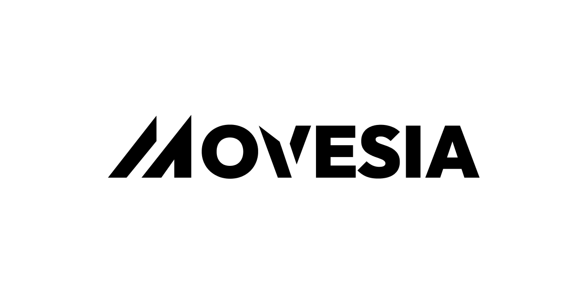

<div align="center">



# Movesia

**AI-powered desktop assistant for Unity Editor**

[](https://www.typescriptlang.org/)
[](https://reactjs.org/)
[](https://electronjs.org/)
[](https://unity.com/)

</div>

---

Movesia connects to your running Unity Editor over a local WebSocket and gives an AI agent real-time access to your scene hierarchy, GameObjects, components, prefabs, assets, and logs. Chat with the agent and it executes Unity Editor operations on your behalf.

## Features

- **Natural language Unity control** &mdash; modify scenes, inspect GameObjects, and manage assets through conversation
- **Real-time connection** &mdash; local WebSocket link to a running Unity Editor
- **LangGraph agent** &mdash; powered by Claude via OpenRouter with 8 specialized Unity tools
- **Conversation persistence** &mdash; sql.js SQLite database for threads and checkpoints
- **Cross-platform** &mdash; Windows, macOS, and Linux

## Quick Start

```bash
pnpm install
pnpm dev
```

## Tech Stack

| Layer | Tech |
|-------|------|
| Desktop runtime | Electron 38 |
| Build tooling | Electron Forge + Vite 7 |
| Frontend | React 19 + Tailwind v4 |
| UI | shadcn/ui + prompt-kit |
| Agent | LangGraph + LangChain |
| LLM | OpenRouter (Claude) |
| Persistence | sql.js (WASM SQLite) |
| Unity comms | WebSocket |

## Project Structure

```
src/
  main.ts              # Electron main process
  preload.ts           # Context bridge (IPC)
  appWindow.ts         # BrowserWindow factory
  channels/            # IPC channel constants
  ipc/                 # Main-process IPC handlers
  menu/                # App menu + context menu
  app/                 # React renderer
    screens/           # Page-level views
    components/        # UI components
    assets/            # Logos, icons, images
    styles/            # Tailwind v4 globals
config/                # Vite configs (main, preload, renderer)
resources/             # App icons, banner
```

## License

MIT
